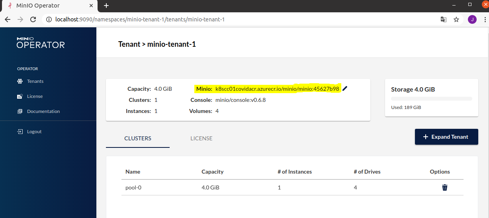

# Minio

Install and configure the [MinIO Operator](https://github.com/minio/minio-operator) using Kustomize.

## Tenants

- Hackathon // HDD @ 200Gi
- Standard // HDD @ 2000Gi
- Premium // SSD @ 200Gi

## Domains

- minio-hackathon-tenant-1.example.ca
- minio-console-hackathon-tenant-1.example.ca
- minio-standard-tenant-1.example.ca
- minio-console-standard-tenant-1.example.ca
- minio-premium-tenant-1.example.ca
- minio-console-premium-tenant-1.example.ca

## References

- https://github.com/minio/minio
- https://github.com/minio/minio-operator
- https://github.com/minio/console
- https://docs.min.io/docs/minio-sts-quickstart-guide
- https://github.com/minio/minio/blob/master/docs/sts/opa.md

# Developement

### Creating a Kind environment

using a Kind environment, you can create your own cluster in which you can test the minio-operator and Minio image.
Follow the steps below to see how.

### install required tools

```bash
# install kind
curl -Lo ./kind https://kind.sigs.k8s.io/dl/v0.11.0/kind-linux-amd64
chmod +x ./kind

# move kind to your path like usr/local/bin/kind
mv ./kind /some-dir-in-your-PATH/kind

# install Krew
# make sure you have git installed before installing the following
set -x; cd "$(mktemp -d)" &&
OS="$(uname | tr '[:upper:]' '[:lower:]')" &&
ARCH="$(uname -m | sed -e 's/x86_64/amd64/' -e 's/\(arm\)\(64\)\?.*/\1\2/' -e 's/aarch64$/arm64/')" &&
curl -fsSLO "https://github.com/kubernetes-sigs/krew/releases/latest/download/krew.tar.gz" &&
tar zxvf krew.tar.gz &&
KREW=./krew-"${OS}_${ARCH}" &&
"$KREW" install krew
```

Add the $HOME/.krew/bin directory to your PATH environment variable. To do this, update your .bashrc or .zshrc file and append the following line

```bash
export PATH="${KREW_ROOT:-$HOME/.krew}/bin:$PATH"
```

### create cluster

```bash
kind create cluster --name my-cluster

# once it's done loading, set kubectl context to your cluster
kubectl cluster-info --context kind-my-cluster

# verify current context. the output should be the cluster you just created
kubectl config current-context
```

### setup Minio Operator

```bash
kubectl krew update
kubectl krew install minio
kubectl minio init
```

You can use `kubectl minio proxy -n minio-operator` to proxy to the minio-operator. The output will be your JWT which will be used as authentication in the Operator UI (http://localhost:9090).

Verify all pods and deployments are successfully running. This may take a minute or two, you can use the tag `--watch` to see the changes:

```bash
kubectl get pods --all-namespaces
kubectl get deployment -n minio-operator
# you should see 2 deployments here, console and minio-operator
```

Your output should be something like this for the pods:


```bash
# clone this repo if you haven't already
cd minio-operator/minio-kind
# create the pvc provisioner
helm template ./manual/provisioner | kubectl apply -f -
```

```bash
# let's check the minio operator image
kubectl get deployment -n minio-operator -o yaml
```

Under .spec.template.spec.containers[0].image you'll see `image: minio/operator:vX.X.X`. This is the image being used in your deployment for the Operator UI.

### Setup Minio Tenant

```bash
kubectl create namespace minio-tenant-1

kubectl minio tenant create minio-tenant-1 \
--servers 1            \
--volumes 4            \
--capacity 4Gi         \
--namespace minio-tenant-1 \
--storage-class local-path
```

Save the password and username somewhere as these will not show up again!


Once your tenant is loaded and ready:

```bash
kubectl -n minio-tenant-1 patch tenants.minio.min.io minio-tenant-1 \
--type='json' -p='[{"op": "replace", "path": "/spec/requestAutoCert", "value":false}]'
```

Let's check what image is used for the tenant:

```bash
kubectl get tenants.minio.min.io minio-tenant-1 -n minio-tenant-1 -o json | jq '.spec.image'
```

You should see something like `minio/minio:RELEASE.2021-02-14T04-01-33Z`.

Check the svc, pvc and pods in your -n minio-tenant-1 namespace to make sure everything is running right with `kubectl get ... -n minio-tennat-1`.

**check minio image from Operator UI:**
1. Open another terminal and run `kubectl minio proxy -n minio-operator`
2. Go to http://localhost:9090 and enter the JWT that was displayed in your terminal.
3. Click on your minio tenant and look for the Minio image! Note, the image below displays a custom Minio image. Instructions for that will follow.




**Now you're ready to port-forward and use Minio!**

```bash
kubectl get svc -n minio-tenant-1
# there should be 3 service accounts: use the one that is not "minio" or "xxx-console" for the next command.
# For mine it was "minio-tenant-1-hl".

kubectl port-forward -n minio-tenant-1 svc/minio-tenant-1-hl 9000:9000

# go to https://localhost:9000
```

### Change MInio Operator Image

If you want to use a custom-built image or a specific version of the Minio Operator, this is where you would make the change:

```bash
# change image
kubectl patch deployment minio-operator -n minio-operator -o yaml  \
--type='json' -p='[{"op": "replace", "path": "/spec/template/spec/containers/0/image", "value":"YOUR-NEW-IMAGE"}]'
```

Verify image change:

```bash
kubectl get deployment minio-operator -n minio-operator -o json | jq '.spec.template.spec.containers[0].image'
```

If it is a custom-built image not in a public dockerhub registry, make sure you load it to your kind environment **first**:

```bash
# if using from statcan private docker registry make sure you're logged in so you can pull images:
az acr login <REGISTRY_NAME>
docker pull <IMAGE_NAME>

# load image to kind
kind load docker-image <IMAGE_NAME> --name my-cluster
```

Now restart your deployment, check that all resources are running/OK and port-forward:

```bash
kubectl rollout restart deployment minio-operator -n minio-operator

kubectl get pods -n minio-operator --watch
```

Once everyting is back up, port-forward and open in browser.

### Change Minio Tenant Image

```bash
kubectl \
-n minio-tenant-1 patch tenants.minio.min.io minio-tenant-1 --type='json' \
-p='[{"op": "replace", "path": "/spec/image", "value":"YOUR-NEW-IMAGE"}]'
```

Verify image change:

```bash
kubectl get tenants.minio.min.io minio-tenant-1 \
-n minio-tenant-1 -o json | jq '.spec.image'
```

If it is a custom-built image not in a public dockerhub registry, make sure you load it to your kind environment **first**:

```bash
# if using from statcan private docker registry make sure you're logged in so you can pull images:
az acr login <REGISTRY_NAME>
docker pull <IMAGE_NAME>

# load image to kind
kind load docker-image <IMAGE_NAME> --name my-cluster
```
Now, wait for pods to terminate and restart then port-forward and open in browser.
